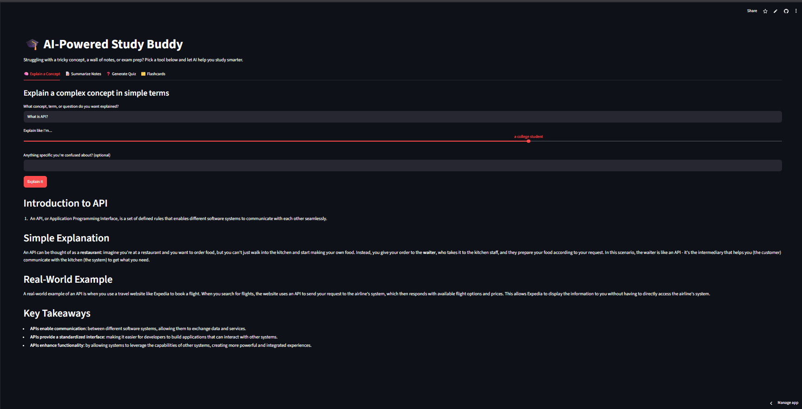

<div align="center">

# 📚 AI-Powered Study Buddy

**Turn confusing topics into clear explanations, messy notes into tidy summaries, and any subject into a ready-to-take quiz — powered by free AI.**

[](https://streamlit.io/)
[](https://console.groq.com/)
[](LICENSE)
[](https://www.python.org/)

</div>

---

## 🧩 The Problem

Students often struggle to understand complex concepts while studying. Searching online gives long or irrelevant results, and teachers aren't always available. There's a need for a tool that can explain topics in simple terms, summarize study notes, and generate quizzes or flashcards on demand — instantly, and for free.

## ✨ What Study Buddy Does

| | Tool | What it does |
|---|---|---|
| 🧠 | **Explain a Concept** | Type any topic or question, pick a difficulty level (5-year-old → expert), and get a clear explanation with an analogy, real-world example, and key takeaways. |
| 📝 | **Summarize Notes** | Paste notes or upload a `.txt`/`.pdf`, choose a summary style — bullet points, outline, or paragraph. |
| ❓ | **Generate Quiz** | Auto-generate multiple-choice questions from any topic or your notes, take the quiz right in the app, and get an instant score with explanations. |
| 🗂️ | **Flashcards** | Auto-generate flashcards from a topic or notes, with a flip-card viewer to study front and back. |

## 🖥️ Demo

> Add your own screenshot or GIF here once deployed — e.g. `docs/screenshot.png`.
>
> ```markdown
> 
> ```

## 🛠️ Tech Stack

- **Frontend + Backend:** [Streamlit](https://streamlit.io/) — single-file Python app, no separate frontend/backend needed
- **AI:** [Groq API](https://console.groq.com/) — free, OpenAI-compatible endpoint, running `llama-3.3-70b-versatile` by default (configurable in the sidebar)
- **PDF parsing:** [pypdf](https://pypi.org/project/pypdf/)
- **Deployment:** [Streamlit Community Cloud](https://streamlit.io/cloud) (free tier)

## 🚀 Quick Start

### 1. Clone the repo
```bash
git clone https://github.com/<your-username>/ai-study-buddy.git
cd ai-study-buddy
```

### 2. Create a virtual environment & install dependencies
```bash
python -m venv venv
source venv/bin/activate      # Windows: venv\Scripts\activate
pip install -r requirements.txt
```

### 3. Add your free Groq API key
Get a free key (no credit card required) at [console.groq.com/keys](https://console.groq.com/keys).

```bash
cp .env.example .env
```
Then edit `.env`:
```
GROQ_API_KEY=gsk-your-key-here
```

> You can also paste your key directly into the app's sidebar at runtime — handy for quick demos without touching `.env`.

### 4. Run the app
```bash
streamlit run app.py
```
The app opens automatically at `http://localhost:8501`.

## ☁️ Deploying for Free

This app deploys in minutes on [Streamlit Community Cloud](https://streamlit.io/cloud):

1. Push this repo to GitHub (see below if you haven't already).
2. Go to [share.streamlit.io](https://share.streamlit.io) and sign in with GitHub.
3. Click **Create app** → select this repo → branch `main` → main file `app.py`.
4. Under **Advanced settings → Secrets**, add:
   ```toml
   GROQ_API_KEY = "gsk-your-key-here"
   ```
5. Click **Deploy** 🎉

Every push to `main` automatically redeploys the live app.

## 📂 Project Structure

```
ai-study-buddy/
├── app.py              # Main Streamlit app — all 4 features live here
├── requirements.txt    # Python dependencies
├── .env.example        # Template for your local environment variables
├── .gitignore          # Keeps .env and other local files out of git
├── LICENSE             # MIT license
└── README.md
```

## 🗺️ Roadmap

- [ ] Export flashcards/quizzes to PDF or Anki format
- [ ] Save quiz history & track progress over time
- [ ] Support for images/diagrams in explanations
- [ ] Multi-language support

## 🤝 Contributing

Contributions, issues, and feature requests are welcome! Feel free to open an issue or submit a pull request.

## 📄 License

Distributed under the [MIT License](LICENSE) — free to use for learning, portfolios, or as a starting point for your own study tools.

---

<div align="center">
Built with ❤️ using Streamlit and Groq
</div>
